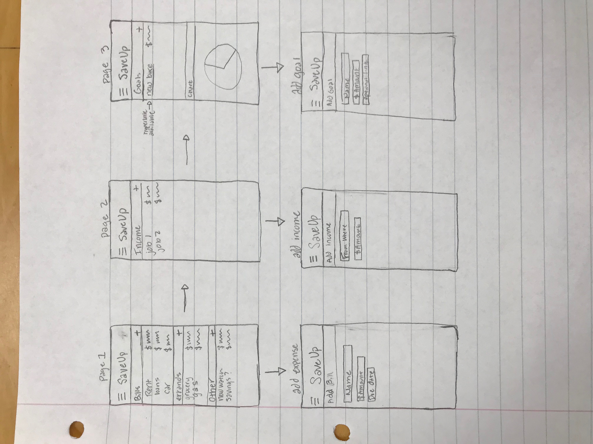

# SaveUp App
## Cody Horman, Michael Scheie, Courtney Wolfe
**Description**: SaveUp is a budgeting app that clients can use to monitor their spending habits. Clients can put in their bills, income, and goals.   
**External Service**: Graphs and hyperlinks  
**Sensor**: Camera for light sensitivity  
**Sketches**: Figure 1 
